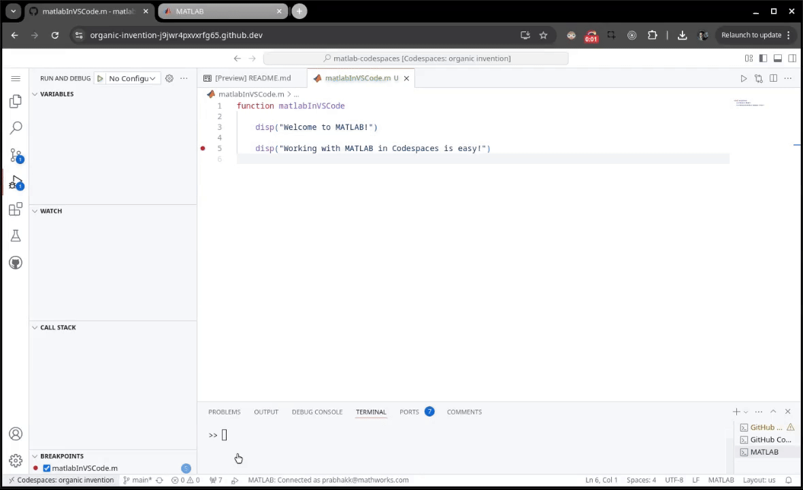

# Run MATLAB in GitHub Codespaces

This repository shows how to run MATLAB&reg; in [GitHub&trade; Codespaces](https://github.com/features/codespaces).

Codespaces allow you to quickly bring up a development environment where you can continue developing on the code hosted in your Github repository, and this repository shows you how you could get MATLAB there.

<details>
<summary><b>When should I use a codespaces?</b></summary>

* Hosting your MATLAB code on a Github repository 
* Want your repo users to quickly have access to MATLAB
* Easy to bring up more complicated environments with MATLAB and other softwares like Python/R/Etc.. 
* Easy way to provide a consistent environment for students/researchers
* Integrated with GIT, and makes it easy for them to contribute to your work/ submit homework.

</details>

<details>
<summary><b>How can I use MATLAB in a codespace?</b></summary>

You can:
1. Run & Debug M files in VSCode
2. Run MATLAB Code from Jupyter Notebooks in VSCode
3. For everything else, you could switch over to using the MATLAB Desktop
4. If you prefer running JupyterLab instead of VSCode, then you can also run notebooks and switch to the desktop there.

For more on VSCode, see [Access MATLAB using Visual Studio Code](#access-matlab-using-visual-studio-code).

For JupyterLab, see [Access MATLAB using JupyterLab](#access-matlab-using-jupyterlab).

</details>

<details>
<summary><b>Great! Now I know I want to use codespaces, which configuration is should I use?</b></summary>


 * Its all down to what you need from your MATLAB.
   * If you only need MATLAB, and no other software, consider using one of the pre-built MATLAB Containers.
     * See [mathworks/matlab](https://hub.docker.com/r/mathworks/matlab)
     * Or [mathworks/matlab-deep-learning](https://hub.docker.com/r/mathworks/matlab-deep-learning)

      See the [Using the MATLAB image on Docker Hub](#using-the-matlab-image-on-docker-hub) for more info.
  
   * If you need to tailor your installation of MATLAB with specific set of toolboxes, or install other software, then you could write your own Dockerfile.
     * See [mathworks-ref-arch/matlab-dockerfile](https://github.com/mathworks-ref-arch/matlab-dockerfile)

      See the [Using MATLAB Dockerfile](#using-matlab-dockerfile) for more info.

   * Finally, if you already have devcontainer configuration and you would like to add MATLAB & its supporting tools you could use the MATLAB Feature for Devcontainers.

      See the [Using the MATLAB Feature for Dev Container](#using-the-matlab-feature-for-dev-container) for more info.
</details>

## Introduction

A [codespace (GitHub Docs)](https://docs.github.com/en/codespaces/overview) is a development environment you can run in the cloud. Codespaces run in Docker containers called development containers, or [dev containers (GitHub Docs)](https://docs.github.com/en/codespaces/setting-up-your-project-for-codespaces/adding-a-dev-container-configuration/introduction-to-dev-containers). You can customize your codespace by modifying `devcontainer.json`, the configuration file of the dev container.

By default codespaces start in a [Visual Studio Code](https://code.visualstudio.com/) environment, but you could also use [JupyterLab](https://jupyter.org) as your IDE.


### Access MATLAB using Visual Studio Code

Once you have MATLAB and the necessary extensions and packages installed into the container, there are **three** ways in which you can use it from the VS Code interface: 

**1. Run & Debug MATLAB files in the VS Code editor.**</br>
   
   
   
   For more information, see [MATLAB Extension for Visual Studio Code](https://github.com/mathworks/MATLAB-extension-for-vscode).


**2. Access the MATLAB IDE in a browser window.**</br>

   

   For more information, see [MATLAB Proxy](https://github.com/mathworks/matlab-proxy?tab=readme-ov-file#usage).

**3. Run MATLAB code using Jupyter Notebooks in VS Code.**</br>
   
   

   For more information, see [Jupyter Notebooks in VS Code](https://code.visualstudio.com/docs/datascience/jupyter-notebooks)

### Access MATLAB using JupyterLab
Codespaces support [opening your codespace in JupyterLab](https://docs.github.com/en/codespaces/developing-in-a-codespace/getting-started-with-github-codespaces-for-machine-learning#opening-your-codespace-in-jupyterlab) as shown below:


When you have `JupyterLab` and the [MATLAB Integration for Jupyter](https://github.com/mathworks/jupyter-matlab-proxy) installed, there are **two** ways in which you can use it from the JupyterLab Interface: 

**1. Run MATLAB code using Jupyter Notebooks.**</br>
   
   

**2. Access the MATLAB IDE in a browser window.**</br>
      
   

## Getting Started

This repository contains three Dev Container configuration files.
These configuration files **mainly** differ in the way MATLAB & supporting tools are installed into them.
Each of them provide **all the access modes specified above**, and can be used from the **VS Code, or JupyterLab** interface.

By default, when the codespaces from any of these configuration files is opened in VS Code.
1. MATLAB will open in a browser tab embedded into the VS Code interface.
2. You can sign in to the page to continue using the MATLAB IDE, or close the tab.


Choose the configuration that is closest to your needs, and tailor it to your liking!

1. [Using the MATLAB Image on Docker Hub](#using-the-matlab-image-on-docker-hub)
2. [Using MATLAB Dockerfile](#using-matlab-dockerfile)
3. [Using the MATLAB Feature for Dev Container](#using-the-matlab-feature-for-dev-container)


### Using the MATLAB image on Docker Hub

Use this [devcontainer.json](.devcontainer/devcontainer.json) when you have an image that is one of the [MathWorks official images published on Docker Hub](https://hub.docker.com/r/mathworks/matlab), or is built on top of them. See [Building on MATLAB Docker Image](https://github.com/mathworks-ref-arch/matlab-dockerfile/tree/main/alternates/building-on-matlab-docker-image) for more information.

You can run the dev container configured above in Codespaces:

[](https://github.com/codespaces/new/mathworks-ref-arch/matlab-codespaces?template=false&devcontainer_path=.devcontainer%2Fdevcontainer.json)

### Using MATLAB Dockerfile

Use this [devcontainer.json](.devcontainer/using-matlab-dockerfile/devcontainer.json) when you want to build an Image from a Dockerfile.
An example Dockerfile taken from the [MATLAB Dockerfile](https://github.com/mathworks-ref-arch/matlab-dockerfile) repository is available within the `.devcontainer/using-matlab-dockerfile` folder.

You can run this dev container in Codespaces:

[](https://github.com/codespaces/new/mathworks-ref-arch/matlab-codespaces?template=false&devcontainer_path=.devcontainer%2Fusing-matlab-dockerfile%2Fdevcontainer.json)

### Using the MATLAB Feature for Dev Container

Use this [devcontainer.json](.devcontainer/using-devcontainer-feature/devcontainer.json) when you would like to add MATLAB & its supporting tools into an existing Dev Container configuration using  self-contained units of code called [Features (GitHub)](https://github.com/devcontainers/features). See the section [below](#more-examples-with-matlab-feature-for-dev-container) for examples.

You can run MATLAB R2024b with this configuration in Codespaces:

[](https://github.com/codespaces/new/mathworks-ref-arch/matlab-codespaces?template=false&devcontainer_path=.devcontainer%2Fusing-devcontainer-feature%2Fdevcontainer.json)

#### More Examples with MATLAB Feature for Dev Container

To install MATLAB `R2024b` in your dev container with the [MATLAB Feature (GitHub)](https://github.com/mathworks/devcontainer-features), use this `devcontainer.json` configuration:

```json
{
  "image": "mcr.microsoft.com/devcontainers/base:ubuntu",
  "features": {
    "ghcr.io/mathworks/devcontainer-features/matlab": {}
  }
}
```

This configuration installs the MATLAB Feature on a `ubuntu` base image, with default settings. 

To customize the settings, modify the [MATLAB Feature Options (GitHub)](https://github.com/mathworks/devcontainer-features/tree/main/src/matlab#options). For example, to install MATLAB `R2023a` instead of `R2024b`, as well as the Symbolic Math Toolbox, use this configuration:

```json
{
  "image": "mcr.microsoft.com/devcontainers/base:ubuntu",
  "features": {
    "ghcr.io/mathworks/devcontainer-features/matlab": {
      "release": "r2023a",
      "products": "MATLAB Symbolic_Math_Toolbox"
    }
  }
}
```


## Related Links

- [Overview of Codespaces (GitHub)](https://docs.github.com/en/codespaces/overview)
- [Development Container Features (GitHub)](https://github.com/devcontainers/features/)
- [Development Container Specification (Microsoft&reg;)](https://containers.dev/implementors/spec/)
- [Setting Your Default Editor for Codespaces (GitHub)](https://docs.github.com/en/codespaces/setting-your-user-preferences/setting-your-default-editor-for-github-codespaces)
- [Run Dev Containers in VS Code (VS Code Docs) ](https://code.visualstudio.com/docs/devcontainers/create-dev-container)

---

Copyright 2024 The MathWorks, Inc.

---
